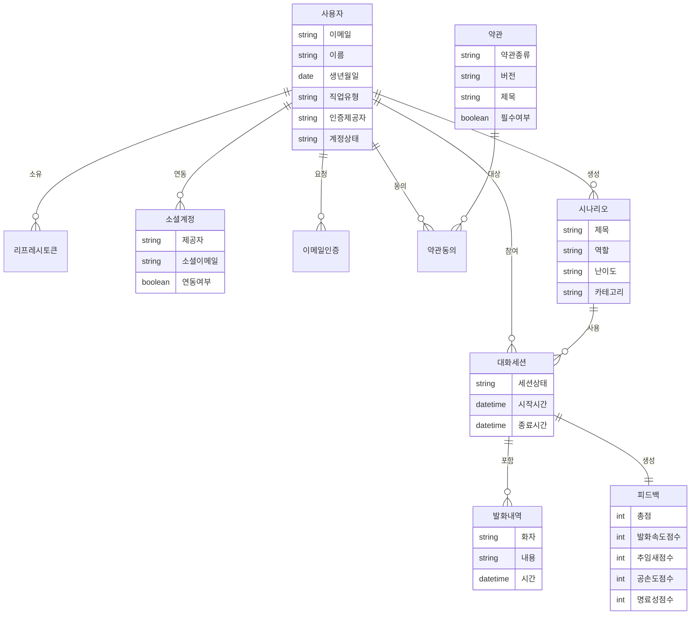

# Dialogym 개념 ERD

**담당자 (Author)**: [왕택준](https://github.com/TJK98)

**검토자 (Reviewer / PO·SM)**: [왕택준](https://github.com/TJK98)

**작성일 (Created)**: 2025.11.01

**문서 버전 (Version)**: v1.0

**문서 상태 (Status)**: Approved

---

## 대상 독자 (Intended Audience)

* **프로젝트 기획자 / PM**: 비즈니스 요구사항과 데이터 모델의 정합성을 확인하는 담당자
* **백엔드 개발자**: 개념 모델을 기반으로 논리/물리 ERD를 설계하는 담당자
* **프론트엔드 개발자**: API 설계와 데이터 흐름을 이해하기 위해 참고하는 담당자
* **신규 합류자**: Dialogym 프로젝트의 핵심 비즈니스 로직과 데이터 구조를 빠르게 파악해야 하는 신규 멤버

---

## 핵심 요약 (Executive Summary)

본 문서는 Dialogym 프로젝트의 개념적 데이터 모델을 정의합니다.
사용자는 시나리오를 선택하여 대화 세션을 진행하고, AI는 대화 내용을 분석하여 피드백을 제공합니다.
인증은 로컬 회원가입과 소셜 로그인을 지원하며, 약관 동의와 이메일 인증 절차를 거칩니다.
핵심 엔티티는 사용자, 시나리오, 대화세션, 발화내역, 피드백으로 구성되며, 모든 엔티티는 사용자를 중심으로 연결됩니다.

---

## 목차 (Table of Contents)

1. [문서 개요](#문서-개요-overview)
2. [개념 ERD 다이어그램](#개념-erd-다이어그램)
3. [주요 엔티티](#주요-엔티티)
4. [비즈니스 규칙](#비즈니스-규칙)
5. [데이터 흐름](#데이터-흐름)

---

## 문서 개요 (Overview)

본 문서는 Dialogym 프로젝트의 개념적 데이터 모델을 비즈니스 관점에서 정의하기 위해 작성되었습니다.

개념 ERD는 기술적 구현 세부사항을 배제하고, 비즈니스 요구사항과 도메인 지식을 중심으로 데이터 구조를 표현합니다.
이를 통해 프로젝트 관계자 모두가 시스템의 핵심 개념과 데이터 흐름을 동일하게 이해할 수 있습니다.

본 문서는 Dialogym 프로젝트의 모든 기능과 데이터 처리 흐름에 적용되며, 논리 ERD와 물리 ERD 설계의 기반이 됩니다.

---

## 개념 ERD 다이어그램



---

## 주요 엔티티

### 사용자 (User)

Dialogym 시스템을 사용하는 회원입니다.
로컬 회원가입 또는 소셜 로그인을 통해 가입할 수 있으며, 모든 엔티티의 중심이 됩니다.

**주요 속성**:
- 이메일: 로그인 ID
- 이름: 사용자 식별 정보
- 생년월일: 만 14세 이상 확인 용도
- 직업유형: 학생, 취업준비생, 직장인 등
- 인증제공자: LOCAL, GOOGLE, KAKAO, NAVER
- 계정상태: ACTIVE, INACTIVE, SUSPENDED, WITHDRAWN

### 소셜계정 (Social Account)

사용자가 연동한 소셜 로그인 계정 정보입니다.
한 사용자는 여러 소셜 계정을 연동할 수 있습니다.

**주요 속성**:
- 제공자: GOOGLE, KAKAO, NAVER
- 소셜이메일: 소셜 계정의 이메일
- 연동여부: 현재 연동 상태

### 약관 (Terms)

서비스 이용약관, 개인정보 처리방침 등 법적 문서입니다.
버전 관리를 통해 약관 변경 이력을 추적합니다.

**주요 속성**:
- 약관종류: SERVICE, PRIVACY, MARKETING
- 버전: 1.0, 1.1 등
- 제목: 약관 이름
- 필수여부: 필수 동의 여부

### 약관동의 (User Consent)

사용자가 특정 약관에 동의한 이력입니다.
필수 약관은 회원가입 시 반드시 동의해야 하며, 선택 약관은 나중에 철회할 수 있습니다.

### 시나리오 (Scenario)

대화 훈련을 위한 상황 설정입니다.
기본 시나리오는 시스템에서 제공하며, 사용자는 커스텀 시나리오를 생성할 수 있습니다.

**주요 속성**:
- 제목: 시나리오 이름
- 역할: AI가 맡을 역할
- 난이도: EASY, MEDIUM, HARD
- 카테고리: 면접, 발표, 협상 등

### 대화세션 (Dialogue Session)

사용자가 시나리오를 선택하여 진행하는 대화 훈련 세션입니다.
세션 중 주고받은 모든 대화는 발화내역으로 저장됩니다.

**주요 속성**:
- 세션상태: ONGOING, COMPLETED, FAILED
- 시작시간: 세션 시작 일시
- 종료시간: 세션 종료 일시

### 발화내역 (Transcript)

대화 세션 중 주고받은 대화 내용입니다.
사용자와 AI의 모든 발화가 시간 순서대로 기록됩니다.

**주요 속성**:
- 화자: USER 또는 AI
- 내용: 발화 텍스트
- 시간: 발화 시점

### 피드백 (Feedback)

AI가 대화 세션을 분석하여 생성한 피드백입니다.
완료된 세션에 대해서만 생성되며, 4가지 항목을 각 25점씩 평가합니다.

**주요 속성**:
- 총점: 100점 만점
- 발화속도점수: 말하는 속도 평가
- 추임새점수: 불필요한 추임새 사용 평가
- 공손도점수: 언어 예절 평가
- 명료성점수: 의사 전달 명확성 평가

---

## 비즈니스 규칙

### 사용자 인증

사용자는 로컬 회원가입 또는 소셜 로그인 중 선택하여 가입할 수 있습니다.
하나의 사용자는 여러 소셜 계정을 연동할 수 있으며, 로컬 계정만 비밀번호를 갖습니다.
소셜 로그인 사용자는 비밀번호를 설정할 수 없으며, 항상 소셜 로그인으로만 인증합니다.

### 약관 동의

필수 약관은 회원가입 시 반드시 동의해야 하며, 동의하지 않으면 가입이 불가능합니다.
선택 약관은 나중에 변경할 수 있으며, 철회 시점이 기록됩니다.

### 대화 훈련

사용자는 시나리오를 선택하여 대화 세션을 시작합니다.
세션 진행 중 모든 대화는 실시간으로 발화내역에 저장되며, 세션 완료 시 자동으로 피드백이 생성됩니다.

### 피드백 생성

완료된 세션에 대해서만 피드백이 생성됩니다.
피드백은 발화속도, 추임새, 공손도, 명료성 4가지 항목을 각 25점씩 평가하여 총 100점 만점으로 계산합니다.
각 항목별 개선 제안과 대체 표현이 함께 제공됩니다.

---

## 데이터 흐름

### 회원가입 및 로그인 흐름

```
1. 사용자 정보 입력
2. 이메일 인증 (로컬 회원가입) 또는 OAuth2 인증 (소셜 로그인)
3. 약관 동의
4. 회원가입 완료
5. 리프레시 토큰 발급
```

### 대화 훈련 흐름

```
1. 사용자가 시나리오 선택
2. 대화세션 시작
3. 사용자와 AI가 대화 진행
4. 모든 발화가 발화내역에 저장
5. 사용자가 세션 종료
6. 세션 상태를 COMPLETED로 변경
```

### 피드백 생성 흐름

```
1. 완료된 대화세션 감지
2. 발화내역을 기반으로 AI가 분석
3. 4가지 항목별 점수 계산
4. 개선 제안 및 대체 표현 생성
5. 피드백 저장
6. 사용자에게 피드백 제공
```

---

변경 이력 (Change Log)

| 버전 | 변경 일자 | 작성자 | 주요 변경 내용 |
|------|-----------|--------|----------------|
| v1.0 | 2025.11.01 | 왕택준 | 초안 작성 및 템플릿 적용 |
