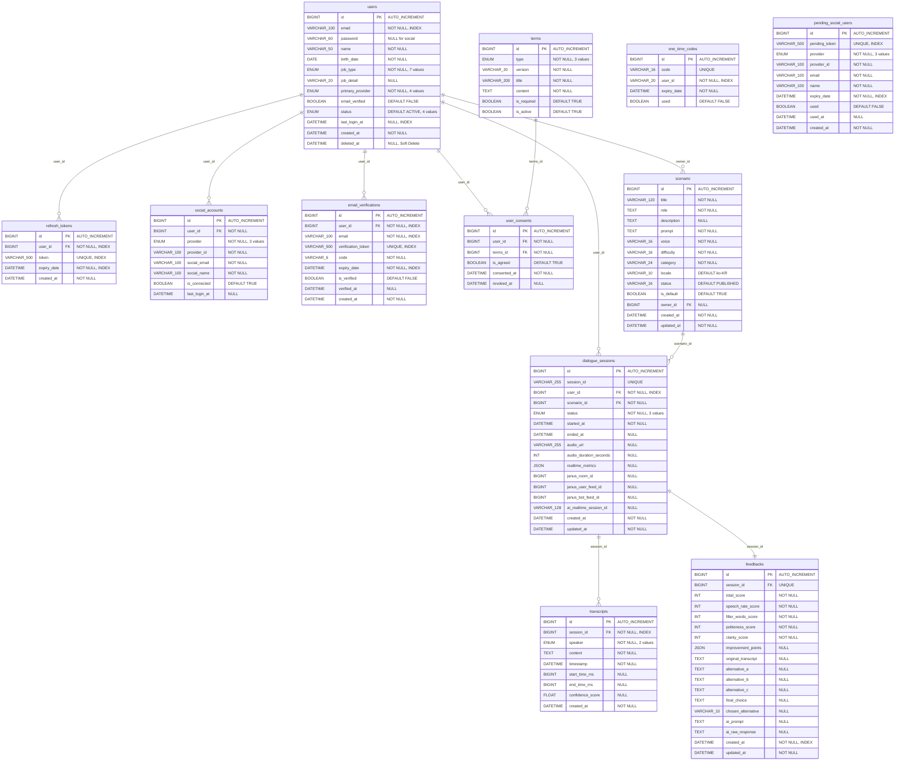

# Dialogym 물리 ERD

**담당자 (Author)**: [왕택준](https://github.com/TJK98)

**검토자 (Reviewer / PO·SM)**: [왕택준](https://github.com/TJK98)

**작성일 (Created)**: 2025.11.01

**문서 버전 (Version)**: v1.0

**문서 상태 (Status)**: Approved

---

## 대상 독자 (Intended Audience)

* **백엔드 개발자**: MySQL DDL 스크립트를 작성하고 JPA 엔티티를 매핑하는 담당자
* **데이터베이스 관리자**: 실제 데이터베이스를 구축하고 인덱스를 최적화하는 담당자
* **인프라 엔지니어**: 스토리지 용량을 산정하고 백업 전략을 수립하는 담당자
* **신규 합류자**: Dialogym 프로젝트의 실제 데이터베이스 구조와 설정을 학습해야 하는 신규 멤버

---

## 핵심 요약 (Executive Summary)

본 문서는 Dialogym 프로젝트의 물리적 데이터 모델을 MySQL 구현 관점에서 정의합니다.
MySQL 8.0 이상을 사용하며, InnoDB 스토리지 엔진과 UTF-8(utf8mb4) 인코딩을 적용합니다.
모든 테이블은 적절한 데이터 타입, 인덱스, 제약 조건을 갖추며, 1만 사용자 기준 약 700MB의 스토리지를 필요로 합니다.
백업은 매일 자동으로 수행되며, 파티셔닝과 캐싱 전략을 통해 성능을 최적화합니다.

---

## 목차 (Table of Contents)

1. [문서 개요](#문서-개요-overview)
2. [물리 ERD 다이어그램](#물리-erd-다이어그램)
3. [물리적 구현 상세](#물리적-구현-상세)
4. [데이터 타입 선택 근거](#데이터-타입-선택-근거)
5. [인덱스 구현](#인덱스-구현)
6. [제약 조건 구현](#제약-조건-구현)
7. [스토리지 추정](#스토리지-추정)
8. [성능 최적화](#성능-최적화)
9. [백업 및 복구](#백업-및-복구)
10. [보안 설정](#보안-설정)

---

## 문서 개요 (Overview)

본 문서는 Dialogym 프로젝트의 물리적 데이터 모델을 MySQL 구현 관점에서 상세히 정의하기 위해 작성되었습니다.

논리 ERD가 DBMS 독립적인 데이터 구조를 표현한다면, 물리 ERD는 MySQL의 구체적인 데이터 타입, 인덱스, 스토리지 엔진 등을 정의합니다.
이를 통해 실제 데이터베이스를 구축하고, 성능을 최적화하며, 운영 전략을 수립할 수 있습니다.

본 문서는 DDL 스크립트 작성, JPA 엔티티 매핑, 데이터베이스 마이그레이션, 성능 튜닝에 적용되며, 모든 데이터베이스 관련 작업의 기준이 됩니다.

---

## 물리 ERD 다이어그램



---

## 물리적 구현 상세

### 데이터베이스 엔진

Dialogym 프로젝트는 다음과 같은 MySQL 환경에서 구동됩니다.

```
DBMS: MySQL 8.0+
스토리지 엔진: InnoDB
문자 인코딩: UTF-8 (utf8mb4)
Collation: utf8mb4_unicode_ci
```

### 테이블 스페이스

```
기본 테이블스페이스: innodb_system
파일 형식: Barracuda (ROW_FORMAT=DYNAMIC)
```

**ROW_FORMAT=DYNAMIC 선택 이유**:
- VARCHAR, TEXT, JSON 타입의 효율적인 저장
- 최대 행 크기 제한 완화
- 압축 지원

---

## 데이터 타입 선택 근거

### 숫자 타입

| 컬럼 | 타입 | 이유 |
|------|------|------|
| id | BIGINT | 최대 9,223,372,036,854,775,807 (92경) 지원, 충분한 확장성 |
| score | INT | -2,147,483,648에서 2,147,483,647 범위로 점수 저장 충분 |
| confidence_score | FLOAT | 소수점 정밀도 필요 (0.0에서 1.0 사이 값) |

### 문자열 타입

| 컬럼 | 타입 | 이유 |
|------|------|------|
| email | VARCHAR(100) | 일반적인 이메일 길이 충분 커버 |
| password | VARCHAR(60) | BCrypt 해시 길이 정확히 60자 |
| token | VARCHAR(500) | JWT 토큰 길이 고려 (일반적으로 200~500자) |
| content | TEXT | 최대 65,535 바이트, 긴 텍스트 저장 |

**VARCHAR vs TEXT 선택 기준**:
- VARCHAR: 인덱스 가능, 고정 길이 지정, 짧은 텍스트
- TEXT: 인덱스 불가 (전체), 가변 길이, 긴 텍스트

### 날짜 및 시간 타입

| 컬럼 | 타입 | 이유 |
|------|------|------|
| created_at | DATETIME | 1000-01-01에서 9999-12-31 범위, 시간 정보 포함 |
| birth_date | DATE | 시간 정보 불필요, 날짜만 저장 |

**DATETIME vs TIMESTAMP**:
- DATETIME: 타임존 독립적, 넓은 범위
- TIMESTAMP: 타임존 자동 변환, 2038년 문제

Dialogym은 DATETIME을 선택하여 타임존을 애플리케이션 레벨에서 관리합니다.

### ENUM 타입

| 컬럼 | 값 개수 | 저장 크기 | 값 예시 |
|------|---------|-----------|---------|
| job_type | 7개 | 1 byte | STUDENT, JOB_SEEKER, EMPLOYEE |
| primary_provider | 4개 | 1 byte | LOCAL, GOOGLE, KAKAO, NAVER |
| status | 4개 | 1 byte | ACTIVE, INACTIVE, SUSPENDED, WITHDRAWN |
| speaker | 2개 | 1 byte | USER, AI |

**ENUM 선택 이유**:
- 메모리 효율적 (1~2 bytes)
- 값 제한으로 데이터 무결성 보장
- 쿼리 성능 향상

**주의사항**:
- 값 추가 시 ALTER TABLE 필요
- 순서 변경 시 기존 데이터 영향 가능

### JSON 타입

JSON 타입은 동적 구조의 데이터를 저장하는 데 사용됩니다.

**적용 컬럼**:
- FEEDBACK.improvement_points: 동적 구조의 개선 사항
- DIALOGUE_SESSION.realtime_metrics: 실시간 메트릭 데이터

**장점**:
- 스키마 변경 없이 유연한 데이터 저장
- MySQL 8.0+의 JSON 함수 지원
- 인덱싱 가능 (Generated Column 활용)

**단점**:
- 쿼리 최적화 제한
- 저장 공간 증가 가능성

---

## 인덱스 구현

### 인덱스 종류

#### PRIMARY KEY (Clustered Index)

모든 테이블은 AUTO_INCREMENT 기본 키를 가지며, 자동으로 CLUSTERED INDEX가 생성됩니다.

```sql
-- 모든 테이블
PRIMARY KEY (id)
```

#### UNIQUE INDEX

중복을 방지하기 위한 유니크 인덱스입니다.

```sql
-- users
UNIQUE KEY uk_email_provider (email, primary_provider)

-- refresh_tokens
UNIQUE KEY uk_token (token)

-- social_accounts
UNIQUE KEY uk_provider_provider_id (provider, provider_id)

-- terms
UNIQUE KEY uk_terms_type_version (type, version)

-- dialogue_sessions
UNIQUE KEY uk_session_id (session_id)

-- feedbacks
UNIQUE KEY uk_session_id (session_id)
```

#### FOREIGN KEY INDEX

JOIN 성능을 향상시키기 위해 외래 키에 인덱스를 생성합니다.

```sql
-- 자동 생성 또는 명시적 생성
INDEX idx_user_id (user_id)
INDEX idx_session_id (session_id)
INDEX idx_scenario_id (scenario_id)
INDEX idx_terms_id (terms_id)
```

#### SEARCH INDEX

WHERE 절에서 자주 사용되는 컬럼에 인덱스를 생성합니다.

```sql
-- users
INDEX idx_user_email (email)
INDEX idx_user_status (status)
INDEX idx_user_last_login (last_login_at)

-- email_verifications
INDEX idx_ev_email_code (email, code)
INDEX idx_ev_expiry (expiry_date)

-- refresh_tokens
INDEX idx_rt_expiry (expiry_date)

-- feedbacks
INDEX idx_feedback_created_at (created_at)
```

### 인덱스 크기 추정

인덱스 크기는 컬럼 타입과 데이터 분포에 따라 달라집니다.

```
BIGINT: 8 bytes
VARCHAR(100): 약 100 bytes (가변)
DATETIME: 8 bytes
ENUM: 1~2 bytes
```

**예시 (users 테이블, 10,000 rows)**:
- PRIMARY KEY (id): 8 bytes × 10,000 = 80KB
- INDEX (email): 100 bytes × 10,000 = 1MB
- INDEX (status): 2 bytes × 10,000 = 20KB

---

## 제약 조건 구현

### 외래 키 제약

외래 키는 참조 무결성을 보장하며, MySQL에서 다음과 같이 구현됩니다.

**CASCADE 삭제**:
```sql
-- 사용자 삭제 시 관련 데이터 자동 삭제
ALTER TABLE refresh_tokens
ADD CONSTRAINT fk_refresh_tokens_user
FOREIGN KEY (user_id) REFERENCES users(id) ON DELETE CASCADE;
```

**NULL 설정**:
```sql
-- 시나리오 소유자 삭제 시 NULL 처리
ALTER TABLE scenario
ADD CONSTRAINT fk_scenario_owner
FOREIGN KEY (owner_id) REFERENCES users(id) ON DELETE SET NULL;
```

### 체크 제약 (ENUM으로 구현)

MySQL 8.0+는 CHECK 제약을 지원하지만, Dialogym은 ENUM으로 구현합니다.

```sql
-- users.job_type
ENUM('STUDENT', 'JOB_SEEKER', 'EMPLOYEE', 'SELF_EMPLOYED',
     'FREELANCER', 'HOUSEWIFE', 'OTHER')

-- users.status
ENUM('ACTIVE', 'INACTIVE', 'SUSPENDED', 'WITHDRAWN')

-- dialogue_sessions.status
ENUM('ONGOING', 'COMPLETED', 'FAILED')

-- transcripts.speaker
ENUM('USER', 'AI')
```

---

## 스토리지 추정

### 테이블별 예상 크기 (1만 사용자 기준)

| 테이블 | 행 수 | 행 크기 | 총 크기 |
|--------|-------|---------|---------|
| users | 10,000 | 약 500B | 약 5MB |
| refresh_tokens | 20,000 | 약 600B | 약 12MB |
| social_accounts | 15,000 | 약 400B | 약 6MB |
| email_verifications | 100 | 약 700B | 약 70KB |
| one_time_codes | 50 | 약 100B | 약 5KB |
| pending_social_users | 50 | 약 700B | 약 35KB |
| terms | 10 | 약 5KB | 약 50KB |
| user_consents | 30,000 | 약 100B | 약 3MB |
| scenario | 100 | 약 2KB | 약 200KB |
| dialogue_sessions | 50,000 | 약 500B | 약 25MB |
| transcripts | 500,000 | 약 300B | 약 150MB |
| feedbacks | 50,000 | 약 5KB | 약 250MB |

**총 예상 크기**:
- 데이터만: 약 450MB
- 인덱스 포함: 약 700MB

**확장성 고려**:
- 10만 사용자: 약 7GB
- 100만 사용자: 약 70GB

---

## 성능 최적화

### 파티셔닝 전략 (향후 고려)

데이터 증가 시 파티셔닝을 적용하여 쿼리 성능을 향상시킵니다.

```sql
-- dialogue_sessions: 월별 파티셔닝
ALTER TABLE dialogue_sessions
PARTITION BY RANGE (YEAR(created_at) * 100 + MONTH(created_at)) (
    PARTITION p202501 VALUES LESS THAN (202502),
    PARTITION p202502 VALUES LESS THAN (202503),
    ...
);

-- transcripts: 월별 파티셔닝
ALTER TABLE transcripts
PARTITION BY RANGE (YEAR(created_at) * 100 + MONTH(created_at)) (
    PARTITION p202501 VALUES LESS THAN (202502),
    PARTITION p202502 VALUES LESS THAN (202503),
    ...
);
```

### 쿼리 최적화

**SELECT 최적화**:
```sql
-- 나쁜 예
SELECT * FROM users WHERE email = 'user@example.com';

-- 좋은 예
SELECT id, email, name FROM users WHERE email = 'user@example.com';
```

**JOIN 최적화**:
```sql
-- 인덱스 활용
SELECT u.name, s.title
FROM users u
JOIN dialogue_sessions ds ON u.id = ds.user_id
JOIN scenario s ON ds.scenario_id = s.id
WHERE u.id = 1;
```

**WHERE 최적화**:
```sql
-- 인덱스 컬럼 우선 사용
WHERE email = 'user@example.com' AND status = 'ACTIVE'
```

**LIMIT 활용**:
```sql
-- 페이지네이션
SELECT * FROM dialogue_sessions
WHERE user_id = 1
ORDER BY created_at DESC
LIMIT 20 OFFSET 0;
```

### 캐싱 전략

**Redis 캐싱**:
- 세션 데이터 (DIALOGUE_SESSION)
- 자주 조회되는 시나리오 (SCENARIO)
- 사용자 프로필 (USER)

**애플리케이션 캐시**:
- 약관 (TERMS)
- 기본 시나리오 (SCENARIO where is_default = TRUE)

### 연결 풀 설정

HikariCP를 사용하여 효율적인 커넥션 풀을 구성합니다.

```properties
spring.datasource.hikari.maximum-pool-size=20
spring.datasource.hikari.minimum-idle=5
spring.datasource.hikari.connection-timeout=30000
spring.datasource.hikari.idle-timeout=600000
spring.datasource.hikari.max-lifetime=1800000
```

---

## 백업 및 복구

### 백업 전략

**전체 백업 (Full Backup)**:
```
주기: 매일 새벽 2시
명령어: mysqldump --all-databases --single-transaction
저장 위치: AWS S3 (암호화)
보관 기간: 30일
```

**증분 백업 (Incremental Backup)**:
```
주기: 매 6시간
방식: Binary Log 기반
저장 위치: AWS S3 (암호화)
보관 기간: 7일
```

**바이너리 로그 (Binary Log)**:
```
용도: 실시간 복제 및 Point-in-Time Recovery
보관 기간: 7일
자동 삭제: expire_logs_days=7
```

### 복구 시나리오

**데이터 손실 복구**:
```bash
# 1. 최근 전체 백업 복원
mysql < backup_20250101_020000.sql

# 2. 바이너리 로그 적용
mysqlbinlog binlog.000001 binlog.000002 | mysql
```

**테이블 손실 복구**:
```bash
# 특정 테이블만 복원
mysql -e "DROP TABLE IF EXISTS users;"
mysql < backup_20250101_020000_users.sql
```

**장애 복구 (Failover)**:
```
1. 슬레이브 DB로 자동 전환
2. 애플리케이션 재시작
3. 마스터 DB 복구
4. 복제 재설정
```

### 복구 테스트

```
주기: 월 1회
절차:
  1. 별도 환경에 백업 복원
  2. 데이터 무결성 검증
  3. 쿼리 성능 테스트
  4. 결과 문서화
```

---

## 보안 설정

### 사용자 권한

**애플리케이션 사용자**:
```sql
CREATE USER 'train_app'@'%' IDENTIFIED BY 'strong_password';
GRANT SELECT, INSERT, UPDATE, DELETE ON train_db.* TO 'train_app'@'%';
FLUSH PRIVILEGES;
```

**읽기 전용 사용자**:
```sql
CREATE USER 'train_readonly'@'%' IDENTIFIED BY 'strong_password';
GRANT SELECT ON train_db.* TO 'train_readonly'@'%';
FLUSH PRIVILEGES;
```

**관리자 사용자**:
```sql
-- 최소 권한 원칙 적용
GRANT ALL PRIVILEGES ON train_db.* TO 'train_admin'@'localhost';
FLUSH PRIVILEGES;
```

### 암호화

**애플리케이션 레벨 암호화**:
- 비밀번호: BCrypt (Salt Rounds = 10)
- 토큰: JWT 서명 (HS256)

**네트워크 레벨 암호화**:
- 전송: TLS/SSL (MySQL 8.0+ 기본 지원)
- 연결 문자열: `useSSL=true&requireSSL=true`

**스토리지 레벨 암호화**:
- 백업 파일: AES-256 (AWS S3 Server-Side Encryption)
- Binary Log: 파일 시스템 레벨 암호화

### 감사 로그

**접근 로그 (General Log)**:
```sql
SET GLOBAL general_log = 'ON';
SET GLOBAL general_log_file = '/var/log/mysql/general.log';
```

**변경 로그 (Binary Log)**:
```sql
SET GLOBAL log_bin = 'ON';
SET GLOBAL binlog_format = 'ROW';
SET GLOBAL expire_logs_days = 7;
```

**에러 로그 (Error Log)**:
```sql
SET GLOBAL log_error = '/var/log/mysql/error.log';
```

---

변경 이력 (Change Log)

| 버전 | 변경 일자 | 작성자 | 주요 변경 내용 |
|------|-----------|--------|----------------|
| v1.0 | 2025.11.01 | 왕택준 | 초안 작성 및 템플릿 적용 |
